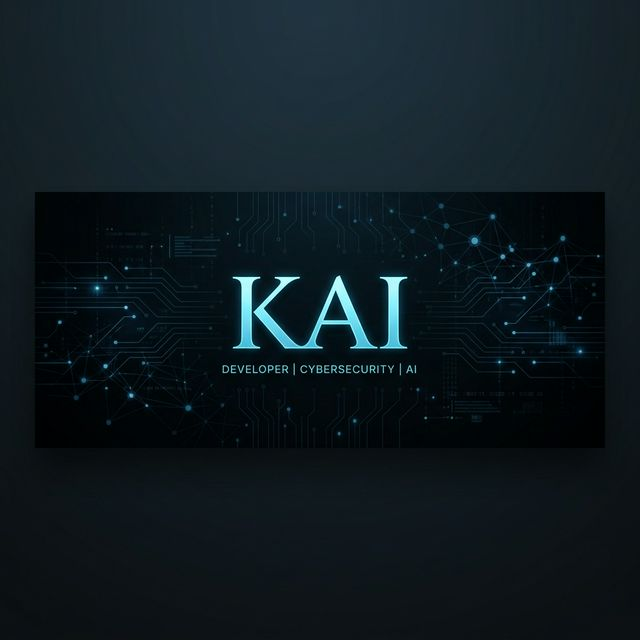

  

  # ⚡ Nishan Paul (KAI)
  ### **AI Systems Architect | Full-Stack Security Engineer | PhD Aspirant (CS '27)**
  
  

    
    
    
    
  

  ---

  *"Bridging the gap between Agentic AI and Cybersecurity to build autonomous, resilient systems."*

## 🚀 About Me

I am a **Full-Stack Developer** and **Security Researcher** (Alumnus of **CUET**) dedicated to architecting high-performance, AI-driven applications. My work focuses on **Multi-Agent Security Orchestration** and **P2P Networking**. I am currently preparing for my **PhD journey (2027-2028)** with a research interest in **Autonomous AI Agents** and **Adversarial Cybersecurity**.

- 🔭 **Lead Developer**: [CMatrix](https://github.com/nishan-paul-2022/cmatrix-agentic-red-team) — An AI-powered VAPT orchestration platform.
- 🧪 **Research Interests**: Multi-agent reasoning, Vector Memory systems, and P2P protocol security.
- 🏆 **Hackathon Winner**: Top 10 at **Vivasoft AI Hackathon 2025**.
- 🧠 **Competitive Programmer**: Former ICPC Regionalist (308th) with 400+ problems solved across Codeforces & LightOJ.
- 🎓 **Academic Goal**: PhD in Computer Science (Artificial Intelligence & Cybersecurity).

---

## 🛠️ Tech Stack & Specialized Expertise

| Category | technologies |
| :--- | :--- |
| **Frontend** |     |
| **Backend** |     |
| **AI & Security** |     |
| **Specialized** |     |

---

## 🌟 Featured Engineering Projects

| Project | Description | Tech Stack | Status |
| :--- | :--- | :--- | :--- |
| **[CMatrix](https://github.com/nishan-paul-2022/cmatrix-agentic-red-team)** | **AI-Powered VAPT Orchestrator.** Multi-agent system for autonomous security scanning. | `LangGraph`, `FastAPI`, `Next.js`, `Qdrant` | 🟢 Active |
| **[Barcody](https://github.com/nishan-paul-2022/barcody-barcode-scanner-for-anything)** | **Universal Barcode Intelligence.** Enterprise-scale scanner with Tailscale private networking. | `Next.js 16`, `NestJS`, `PostgreSQL`, `Tailscale` | 🟢 Active |
| **[Flick](https://github.com/nishan-paul-2022/flick-p2p-file-sharing)** | **Instant P2P File Sharing.** Direct device-to-device transfers using WebRTC. | `Next.js 15`, `PeerJS`, `WebRTC`, `Framer Motion` | 🚀 [Live](https://flick.kaiofficial.xyz) |
| **[Markify](https://github.com/nishan-paul-hello/markify-md-to-pdf-converter)** | **MD to PDF Suite.** High-fidelity PDF generation with Mermaid & real-time preview. | `Next.js`, `Playright`, `Zustand`, `PostgreSQL` | 🚀 [Live](https://markify.kaiofficial.xyz) |

---

## 📊 Analytics & Impact

  
  

  

---

## 🎓 Academic Research Hub

Currently documenting my path to a PhD in **Computer Science**. My research focuses on the intersection of **Generative AI** and **Autonomous Cybersecurity Systems**.

- 📜 [PhD Application Materials](https://github.com/nishan-paul-2022/PhD-Application) (Research Statements, GRE/IELTS Prep)
- 📝 [Research Statement Drafts](https://github.com/nishan-paul-2022/PhD-Application/tree/main/RS)
- 📚 [Curated CS Research Roadmap](https://github.com/nishan-paul-2022/PhD-Application/tree/main/📚-Test-Preparation)

---

## 📫 Let's Connect

- **Portfolio**: [kaiofficial.xyz](https://kaiofficial.xyz)
- **LinkedIn**: [Nishan Paul](https://www.linkedin.com/in/nishanpaul2022/)
- **Email**: [nishan.paul.hello@gmail.com](mailto:nishan.paul.hello@gmail.com)

  

---

  <i>"Simplicity is the ultimate sophistication." — Leonardo da Vinci</i>

